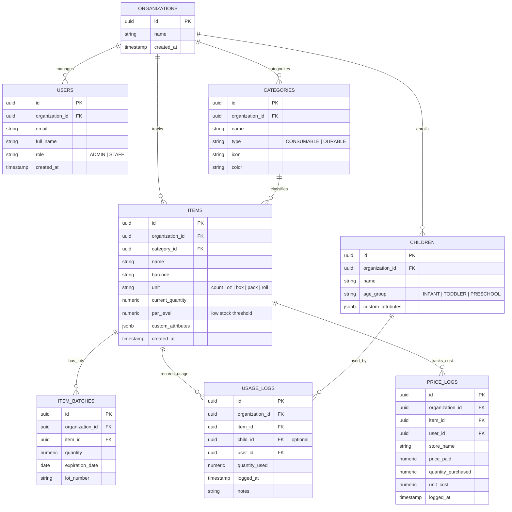

# Implementation Plan: Daycare & Babysitter Inventory + Supply Tracking System

An intuitive, mobile-responsive, PWA-ready web application built **specifically for Daycares & Babysitters** to track supplies, log usage, monitor low-stock levels, predict burn rates, log price history, and manage costs per child. 

> **Future-Proof Architectural Note**: Under the hood, database entities use clean, adaptable schema patterns (`organization_id`, `targets`, `custom_attributes`) so if you ever choose to adapt the platform for mechanics, clinics, or other businesses in the future, you can do so easily without needing to refactor the database.

---

## 1. Core Focus: Daycare & Babysitter Experience

The entire user interface is tailored specifically for daycare staff, babysitters, and daycare managers:

- **Quick Supply Tracking**:
  - Diapers (Size 1-6), Wipes, Formula, Milk, Snacks, Bibs, Gloves, Cleaning Supplies.
- **Target Tracking**:
  - Enrolled Children / Infants / Toddlers.
- **Alert System**:
  - 🟡 **Low Stock Par Level Alert** (e.g. Diapers < 25 packs).
  - ⏳ **Expiration Warning** (e.g. Formula/Milk/Medication expiring within 7/14 days).
- **Camera Barcode Scanner**:
  - Quick 1-tap scan to log diaper usage or scan new supply items.
- **Manual Price & Vendor Tracking**:
  - Compare prices paid at Costco, Target, Walmart, Amazon over time.

---

## 2. Multi-Tenant Ready Schema (`organization_id` on every table)

---

## 3. Phased Development Roadmap (Vertical Slices)

We build iteratively starting with the core thin slice:

- **Slice 1 (Core Thin Slice)**:
  - Add item (Name, Unit, Par Level, Initial Quantity).
  - Quick Usage Log (`-1 Used`).
  - Low-Stock Alert flag when item drops below set par level.
- **Slice 2 (Daycare Supply Categories)**:
  - Categories (Consumable vs Durable, Age Group tags: Infant, Toddler, Preschool).
  - Category search & filter pills.
- **Slice 3 (Expiration Date Tracking)**:
  - Expiration date tracking for formula, food, and medication.
  - Expiry alert warning dashboard.
- **Slice 4 (Camera Barcode Scanning)**:
  - Integrated browser camera scanner modal with audio beep feedback.
- **Slice 5 (Manual Price History & Store Logging)**:
  - Store price logging (Store name, total price, unit cost).
  - Vendor cost history chart (Costco vs Target vs Amazon).
- **Slice 6 (Burn-Rate & Cost-per-Child Analytics)**:
  - Burn-rate forecasting ("Will run out in N days").
  - Cost per child / week report.
- **Slice 7 (User Roles & Auth)**:
  - Admin view (Costs, Budget, User Management) vs Staff view (Quick Log & Barcode Scan).

---

## Verification Plan

### Automated Tests
- Test usage decrement logic and low-stock alert triggers.
- Test expiry date calculation.
- Test database schema compliance (`organization_id` everywhere).

### Manual Verification
- Test item creation, quick log button, and instant low-stock badge trigger.
- Test camera barcode scanner integration.
- Verify cost-per-child metrics and vendor price history displays.
